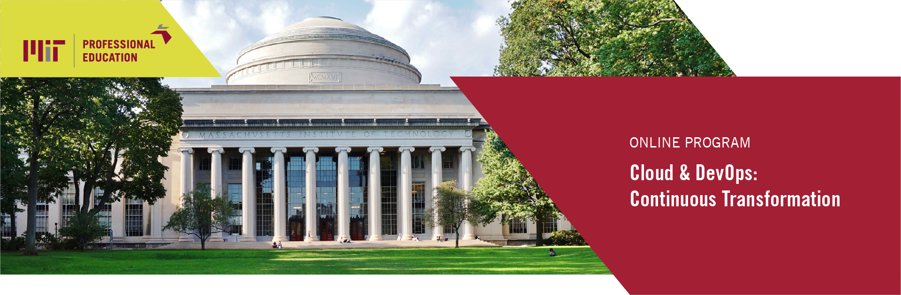

Notes from the online course Cloud & DevOps from MIT:

- [Module 1](https://github.com/simoneghezzi/mit_cloud_devops/wiki/Module-1-%E2%80%90-Cloud) - Cloud
- [Module 2](https://github.com/simoneghezzi/mit_cloud_devops/wiki/Module-2-%E2%80%90-Web-computing) - Web computing and Node.js
- [Module 3](https://github.com/simoneghezzi/mit_cloud_devops/wiki/Module-3-%E2%80%90-Containers-and-PKI) - Containers and PKI
- [Module 4](https://github.com/simoneghezzi/mit_cloud_devops/wiki/Module-4-%E2%80%90-DevOps) - DevOps
- [Module 5](https://github.com/simoneghezzi/mit_cloud_devops/wiki#:~:text=Module%205%20%E2%80%90%20case%20studies) - case studies
- [Module 6](https://github.com/simoneghezzi/mit_cloud_devops/wiki#:~:text=Module%206%20%E2%80%90%20Serverless%20and%20Microservices) - Serverless and Microservices
- [Module 7](https://github.com/simoneghezzi/mit_cloud_devops/wiki/Module-7-%E2%80%90-Agile-&-OODA) - Agile & OODA
- [Module 8](https://github.com/simoneghezzi/mit_cloud_devops/wiki/Module-8-%E2%80%90-Cloud-native) - Cloud native & [final assignment](https://github.com/simoneghezzi/mit_cloud_devops/wiki/Module-8-%E2%80%90-Final-assignment:-cloud-roadmap-for-a-hospital)  
  

